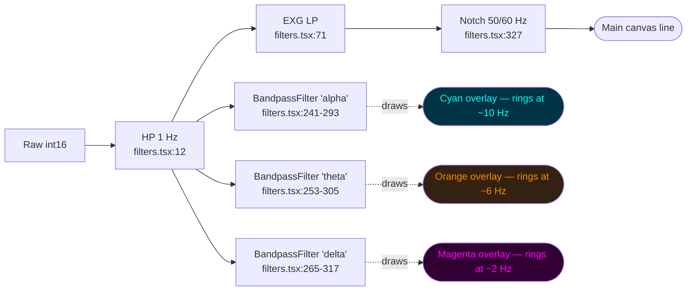
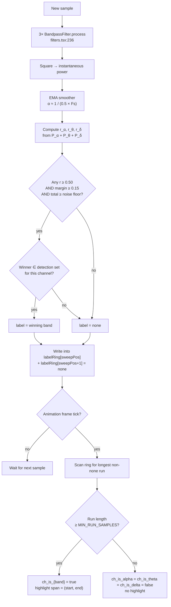

# Per-Channel Band Predominance Detection (Alpha / Theta / Delta)

An **additive** feature on top of the existing brainwave-band overlays. Adds a per-channel boolean state (`ch{N}_is_alpha`, `ch{N}_is_theta`, `ch{N}_is_delta`) plus an on-canvas highlight over the most recent sustained run of a dominant band.

**The primary consumer is TouchDesigner.** This project guides users through activities that are supposed to synchronize (or de-synchronize) two participants' brain activity; TD reads these booleans alongside the other streamed data and compares predominant activity across devices/sessions. The on-canvas highlight is a sanity check for the operator — the booleans on the wire are the product.

The existing overlay-line toggles (Alpha / Theta / Delta in the Brainwave Bands popover) stay exactly as they are. We add a **second, independent set of per-band toggles** for "highlight when predominant". Users can enable any subset:

- Just **Alpha highlighting** → highlight + set `is_alpha = true` only when alpha is the predominant band among the three; otherwise all three booleans stay false (even if theta or delta would currently win).
- **Alpha + Delta highlighting** → highlight + set the corresponding boolean when either alpha or delta is currently winning. Theta-dominant epochs don't get highlighted and `is_theta` stays false.
- **All three** → highlight whichever band wins, when one does.
- **None** → detection runs invisibly (or doesn't run at all — see §6); booleans stay false.

The competition between bands is **always over all three**: relative power is computed as `P_band / (P_α + P_θ + P_δ)` regardless of which detection toggles are on. The toggles only decide which winners are *reported* and *drawn*. That way the meaning of "predominantly alpha" doesn't change based on which detection boxes the user has ticked.

---

## 1. What the existing overlay does — and what it doesn't tell us

When a band is toggled on in the Brainwave Bands popover, each sample's HP-filtered value is pushed through a 4th-order Butterworth bandpass and the result is drawn as an extra WebGL line on top of the main waveform.

Relevant code:

| Reference | What happens |
|---|---|
| `src/components/filters.tsx:211-325` | `BandpassFilter` class — HP biquad (8 Hz / 4 Hz / 1 Hz) cascaded with an LP biquad (12 Hz / 7.5 Hz / 4 Hz). |
| `src/app/dual-stream/page.tsx:667-676` | Per sample, `filter.process(hpOutput) * ADC_Y_SCALE` is written into `bandDataRef[band][channel]`. |
| `src/app/dual-stream/page.tsx:594-610` | The band value (× user gain, default `3.0`) is drawn at the same sweep cursor position as the main line. |
| `src/app/dual-stream/page.tsx:199-203` | Per-band colours: Alpha `#00FFFF`, Theta `#FF8800`, Delta `#FF00FF`. |

### Why the doctor's intuition is correct

A 4th-order bandpass is a resonator. Feed it noise, a heartbeat, a blink, a step — the **output rings at the centre of the passband regardless of the input content**. At 8–12 Hz the ring looks like a 10 Hz sine, at 4–7.5 Hz like a 6 Hz sine, at 1–4 Hz like a 2 Hz sine. So the line on the canvas always *looks* like alpha / theta / delta whether or not the brain is actually producing that rhythm.

That matches what was observed: the lines are "fit to some points of the data" — they're a mathematical consequence of running the filter, not a measurement of in-band activity.



The filters aren't wrong — they output exactly what Butterworth bandpasses output. They just answer a different question than the user expected. The overlay is useful as a visualization of what the bandpass *would* extract, but it can't be read as "the brain is producing alpha right now". The new feature answers the question the overlay can't: **is the channel's energy currently concentrated in alpha vs. theta vs. delta, and for how long?**

The overlays stay available for users who want to see the filter outputs; predominance detection is a separate layer on top.

---

## 2. The right question

What a clinician asks when looking at a strip:

> "In the last few seconds, is there a sustained stretch where one band dominates the rest?"

That maps to a per-channel state with four possibilities:

- `is_alpha = true`, others `false`
- `is_theta = true`, others `false`
- `is_delta = true`, others `false`
- all three `false` — mixed activity, the default

Plus, for display purposes, a span `(startSample, endSample)` describing **where on the visible sweep the dominant run lives**, so the user can see the section the verdict refers to rather than a single instantaneous indicator.

---

## 3. The algorithm — three stages

### Stage A — power envelope per band (not signal)

Keep using `BandpassFilter` (`filters.tsx:211-325`) but treat it as an **analysis filter**, not a display source. Per sample, per channel, per band:

```
band_signal_t = BandpassFilter.process(hpOutput)
inst_power_t  = band_signal_t * band_signal_t
power_t       = (1 - α) * power_{t-1} + α * inst_power_t        // EMA
```

Choose `α` for a ~500 ms time constant. At 500 Hz, `α ≈ 1 / (0.5 * 500) = 0.004`. At 250 Hz, `α ≈ 0.008`.

**Why squaring + smoothing solves the ringing problem.** A ringing filter with no real in-band input produces small, mostly-noise oscillations whose squared envelope settles low. A filter driven by genuine in-band brain activity produces large oscillations whose squared envelope settles high. Power is the discriminator; the raw band signal isn't.

The envelope is a single non-negative number per sample, per band, per channel.

### Stage B — per-sample classification

For each sample, compute:

```
total = P_α + P_θ + P_δ
r_α   = P_α / total
r_θ   = P_θ / total
r_δ   = P_δ / total
```

Label this sample `alpha` iff **all four** conditions hold:

- `r_α ≥ DOMINANCE_THRESHOLD`  (default `0.50` — alpha alone is more than the other two combined)
- `r_α − max(r_θ, r_δ) ≥ MARGIN`  (default `0.15` — clear margin over runner-up, prevents flapping when two bands are nearly tied)
- `total ≥ NOISE_FLOOR`  (default `1e-6` in post-`ADC_Y_SCALE` units, where `ADC_Y_SCALE = 2/4096` per `dual-stream/page.tsx:652`)
- `alpha` is in the channel's **detection set** (the per-band toggles the user enabled for this channel — see §5).

Same shape for `theta` and `delta`. Mutually exclusive by construction — only one ratio can exceed 0.5 of the sum of three non-negatives, so no tie-breaking needed.

If none of the three pass, the sample is labelled `none`. Critically, if a band would win the dominance + margin test but **isn't in the detection set**, the sample is also `none` — so unselected bands can never trigger a highlight or flip a boolean, but they still count toward `total` and can suppress other bands' wins (e.g. if the user selected only "alpha" but delta is actually dominant, the sample is correctly labelled `none` rather than wrongly labelled `alpha`).

Visualising the envelopes during a clean alpha burst (ASCII, with t in seconds and relative power 0 – 1):

```
power
 1.0 |                  ___________
     |                 /           \
 0.8 |              __/             \__
     |    α        /                   \           α
 0.6 |    ......../                     \..........
     |   .       /                       \        .
 0.4 |    θ θ θ θ                         θ θ θ θ θ
     |    δ δ δ\                         /δ δ δ δ δ
 0.2 |.........\                        /..........
     |          \____   ____   ___   __/
 0.0 |_________________________________________________  t (s)
       0     1     2     3     4     5     6     7

label:  none  none  none  ALPHA ALPHA ALPHA  none  none
```

Between t≈2.5 s and t≈5.5 s alpha dominates: `r_α > 0.5` and the gap over theta/delta exceeds 0.15. Outside that window the three powers are too close to call.

### Stage C — find the longest on-screen run

Maintain a **label ring buffer** of length `dataPointCount` (matches the visible sweep — see `dual-stream/page.tsx:236`, `dataPointCountRef.current = samplingrateref.current * timeBase`). Each slot holds `'alpha' | 'theta' | 'delta' | 'none'`.

Write to it exactly the way the main line is written — at index `sweepPos`, with a one-slot `none` "gap" written one position ahead so a wrap-around boundary doesn't get falsely merged. That gap mirrors the existing NaN-cursor pattern at `dual-stream/page.tsx:591-592`.

Once per animation frame (not per sample — this is O(N) and only needs to run at display rate), scan the ring and find the longest contiguous run of a single non-`none` label. Two outputs:

- **Boolean state.** If the longest run's length ≥ `MIN_RUN_SAMPLES` (default `0.5 × samplingRate`, i.e. 500 ms), set the corresponding channel boolean. Otherwise all three booleans are `false`.
- **Highlight span.** The run's `(startIdx, endIdx)` in the ring become the x-range for a translucent highlight rectangle drawn behind the main signal.



A worked example of Stage C with a 12-sample visible window (just for illustration — real `dataPointCount` is in the thousands):

```
sweepPos →                                 cursor
labelRing index:  0   1   2   3   4   5   6   7   8   9  10  11
label:           [α   α   α   α   ·   θ   θ   ·   δ   δ   α   α ]
                                  ^gap            ^gap

runs of non-none labels:
  α: indices 0..3   length 4
  θ: indices 5..6   length 2
  δ: indices 8..9   length 2
  α: indices 10..11 length 2

longest = α (length 4)
if 4 ≥ MIN_RUN_SAMPLES  → ch_is_alpha = true,  span = (0, 3)
else                    → all three false
```

The "gap" entries (written one ahead of the cursor) prevent the trailing α run at indices 10–11 from being spuriously merged with the leading run at 0–3 across the wraparound.

---

## 4. What the canvas should show

Two independent visual layers, each with its own per-band toggles:

1. **Existing overlay lines** (Cyan / Orange / Magenta) — unchanged. Toggled by `d1EnabledBandsRef` / `d2EnabledBandsRef` (`dual-stream/page.tsx:189-190`) and drawn at `dual-stream/page.tsx:594-610`. Use them when you want to see what each bandpass extracts.
2. **New predominance highlight** — a translucent coloured rectangle drawn *behind* the main line over the detected run's x-range. Toggled by a separate `d1DetectionBandsRef` / `d2DetectionBandsRef` per-channel set.

Both can be on at once, both can be off, or either can be on alone. They share the same colours so the overlay line and the highlight that triggered it are visually linked.

When the predominance highlight is active, the canvas looks like this:

```
┌──────────────────────────────────────────────────────────┐
│ CH1  ● Alpha (3.2 s)                                     │
│                                                          │
│         ░░░░░░░░░░░░░░░░░░░░░░                           │
│   ╲    ░╲    ╱╲    ╱╲    ╱╲░░    ╱╲                      │
│    ╲  ╱ ░ ╲╱   ╲  ╱  ╲  ╱  ░░  ╱   ╲                     │
│     ╲╱  ░         ╲╱    ╲╱   ░░╱                         │
│         ░░░░░░░░░░░░░░░░░░░░░░                           │
│ ──────────────────────────────────────────────  zero     │
│         └──── highlighted alpha run ────┘                │
└──────────────────────────────────────────────────────────┘
```

When all three booleans are false, no rectangle is drawn — which will be the case most of the time on real EEG, and is the honest answer. If the user only enabled, say, alpha detection and the brain is currently delta-dominant, no rectangle is drawn either: detection saw delta win, but delta isn't in the detection set, so the result is `none`.

Two implementation options for the rectangle:

1. **HTML overlay** — `position: absolute` div over the canvas, x and width computed from `(startIdx, endIdx) / dataPointCount`. Simplest; doesn't touch WebGL. Matches the existing legend-overlay pattern at `dual-stream/page.tsx:372-389`.
2. **WebGL rect** — add a `WebglLine` of `numPoints=2` styled as a thick semi-transparent horizontal bar at y=0, positioned over the run. Stays inside the WebGL render path.

HTML is simpler and the perf impact is negligible at one div per channel.

---

## 5. UI additions in the Brainwave Bands popover

The popover keeps everything it currently has (the existing Alpha / Theta / Delta overlay toggles per channel and the gain slider — `dual-stream/page.tsx:178-203`). Add a **second row of toggles per channel** for predominance detection plus **per-channel sensitivity sliders**:

```
┌─ Brainwave Bands ─────────────────────────────────────────┐
│                                                            │
│  Ch 1                                                      │
│    Overlay line:   [Alpha ■]  [Theta □]  [Delta □]         │  ← existing
│    Highlight when                                          │
│    predominant:    [Alpha ■]  [Theta ■]  [Delta □]         │  ← NEW
│    Overlay gain:   [────●────] 3.0×                        │  ← existing
│    Detection sensitivity:                                  │  ← NEW
│      Dominance ≥ [────●────] 0.50                          │
│      Margin    ≥ [──●──────] 0.15                          │
│      Min run % [─────●───] 12 %  of time base              │
│      Smoothing   [───●─────] 500 ms                        │
│      Noise floor [──●──────] 1e-6                          │
│                                                            │
│  Ch 2  … (independent set of sliders)                      │
│  Ch 3  …                                                   │
└────────────────────────────────────────────────────────────┘
```

State refs to add alongside the existing ones at `dual-stream/page.tsx:189-192`:

```ts
const d1DetectionBandsRef = useRef<{ [channel: number]: Set<BandType> }>({});
const d2DetectionBandsRef = useRef<{ [channel: number]: Set<BandType> }>({});

interface DetectionParams {
    dominance: number;     // 0.50
    margin: number;        // 0.15
    minRunFrac: number;    // 0.12  (fraction of timeBase, see below)
    emaMs: number;         // 500
    noiseFloor: number;    // 1e-6
}
const d1DetectionParamsRef = useRef<{ [channel: number]: DetectionParams }>({});
const d2DetectionParamsRef = useRef<{ [channel: number]: DetectionParams }>({});
```

Per-channel rather than global. In practice only one channel is being read today (`selectedChannels` typically has length 1, `dual-stream/page.tsx:74`), but electrode placement and skin contact can change baseline amplitude per channel, so the sliders must be addressable per channel as the number of active channels grows.

UI rendering can mirror the existing per-channel rows in the filter popover — show one slider block per channel currently in `selectedChannels`, hide the rest.

### Parameter defaults

| Param | Default | Notes |
|---|---|---|
| EMA time constant | 500 ms | Lower = jumpier label, higher = laggy. Matches clinical epoch length. |
| `DOMINANCE_THRESHOLD` | 0.50 | Winner's relative power must exceed the other two combined. |
| `MARGIN` | 0.15 | Gap above runner-up; prevents oscillation near ties. |
| `NOISE_FLOOR` | 1e-6 | In post-`ADC_Y_SCALE` units (`ADC_Y_SCALE = 2/4096` per `dual-stream/page.tsx:652`). |
| `minRunFrac` | 0.12 | Minimum run as a fraction of the visible sweep (12 % of `timeBase`). At `timeBase = 4 s` this is 480 ms; at `timeBase = 10 s` it grows to 1.2 s — so the highlight stays similarly visible regardless of the user's zoom level (see §8 resolution below). |

### `MIN_RUN_SAMPLES` is derived, not stored

`MIN_RUN_SAMPLES = floor(minRunFrac × dataPointCount)`, recomputed live whenever `timeBase` changes (the same `useEffect` at `dual-stream/page.tsx:236` that already recomputes `dataPointCountRef.current = samplingrateref.current * timeBase` should also rebuild the per-channel `labelRing` `Uint8Array`s and the cached threshold). The label ring is already tied to `dataPointCount`, so the resize logic is the same kind of work that already happens when a user changes `timeBase`.

### Gain slider stays as-is

The existing gain slider (`d1BandGainRef` / `d2BandGainRef`, `dual-stream/page.tsx:191-192`) is untouched — it still scales overlay-line amplitude. Detection is power-based and scale-invariant, so it doesn't read the gain at all.

---

## 6. Code touchpoints — proposed changes

Everything additive — nothing in the existing band-overlay path is removed.

| File | Lines | Change |
|---|---|---|
| `src/components/filters.tsx` | after 325 | Add `BandPowerEnvelope` helper class wrapping a `BandpassFilter` + EMA smoother. `process(input) → smoothed power`. The existing `BandpassFilter` (lines 211-325) is unchanged and is still used directly by the overlay path. |
| `src/app/dual-stream/page.tsx` | after 196 | Add new refs alongside the existing band state — do **not** modify the existing ones: `d1DetectionBandsRef`, `d2DetectionBandsRef` (per-channel `Set<BandType>` of bands the user wants to detect), `d1BandEnvelopesRef`, `d2BandEnvelopesRef` (3 envelopes × 3 channels), `d1LabelRingRef`, `d2LabelRingRef` (3 channels × `Uint8Array(dataPointCount)`, encoding 0=none, 1=alpha, 2=theta, 3=delta), `d1BandStateRef`, `d2BandStateRef` (`{ [ch]: { is_alpha, is_theta, is_delta, runStart, runEnd, runBand } }`). |
| `src/app/dual-stream/page.tsx` | 226-231 | Add envelope init next to the existing band-filter init (`setSamplingRate` on each envelope's wrapped `BandpassFilter`, plus EMA constant computed from `Fs` and the smoothing config). |
| `src/app/dual-stream/page.tsx` | 667-676 | **Add to** the existing band-filter loop, don't replace it. The current "for each enabled overlay band, run filter and store" stays. Append: "if *any* detection band is enabled for this channel, run all three envelopes (regardless of which detection bands are selected, because dominance is computed over the full triple), classify (Stage B with the detection-set gate), write the label into `labelRing[sweepPos]` and `none` into `labelRing[sweepPos+1]`". Skip the envelope work entirely if the channel's detection set is empty. |
| `src/app/dual-stream/page.tsx` | 594-610 | **Leave the band-line draw loop in place.** It draws overlay lines for bands in `enabledBandsRef` — that behaviour doesn't change. |
| `src/app/dual-stream/page.tsx` | new (animation loop, alongside the existing rAF tick) | For each channel where the detection set is non-empty: scan `labelRing` for longest contiguous non-`none` run (Stage C); update `d{1,2}BandStateRef`; reposition the highlight overlay div. |
| `src/app/dual-stream/page.tsx` | 372-389 | Extend the existing legend overlay so it shows two kinds of chips: existing overlay chips ("● Alpha" from `enabledBandsRef`) and a new "● Alpha 3.2 s" chip when detection has fired (from `BandStateRef`). Different styling (e.g. a dot for overlay, a filled bar for detection) to keep them distinguishable. |
| `src/services/WebSocketStreamer.ts` | 79-85, 102-110 | **Strictly additive — do not change existing keys.** Add `setDevice{1,2}BandState(channel, { is_alpha, is_theta, is_delta })`. Append the new booleans to the end of the filtered message after the existing payload. TouchDesigner patches that read the current keys must continue to work unchanged. |
| Brainwave Bands popover | UI | Add the new "Highlight when predominant" toggle row per channel and the global sensitivity sliders (see §5). The existing overlay-toggle row and gain slider are untouched. |

### Performance note

The cost added by this feature is bounded: 3 envelopes × 3 channels × 2 devices × Fs = 9 × 2 × 500 ≈ 9 k envelope updates/s. Each envelope is one biquad pair + one multiply-add for the EMA, so ~15 FLOPs. Total: ~135 k FLOPs/s — well below the budget called out in `EEG_BAND_ISOLATION_PLAN.md:115`. The label-ring scan (Stage C) runs once per animation frame, not per sample, and is O(dataPointCount × channels) per device.

Detection work is gated by `detectionBandsRef[channel].size > 0` — channels with no detection toggles enabled pay nothing.

### WebSocket message — strictly additive

The TouchDesigner contract is append-only. Existing keys keep their names, types, and ordering. Detection booleans are appended at the end of the message so downstream patches that select by key (the normal TD CHOP/DAT pattern) are unaffected, and patches that depend on field ordering see only new fields *after* the ones they already read.

Current `sendFiltered` shape (from `WebSocketStreamer.ts:92-100, 102-111`) — unchanged:

```json
{
  "ts": 1234.56,
  "d1_ch0": 0.12, "d1_ch1": 0.08, "d1_ch2": -0.03,
  "d2_ch0": 0.14, "d2_ch1": 0.05, "d2_ch2": -0.02,

  "d1_ch0_alpha": 0.018, "d1_ch1_alpha": 0.011,
  "d1_ch0_theta": 0.007,
  "d2_ch0_delta": 0.024
}
```

After this feature — same keys, new ones appended at the end:

```json
{
  "ts": 1234.56,
  "d1_ch0": 0.12, "d1_ch1": 0.08, "d1_ch2": -0.03,
  "d2_ch0": 0.14, "d2_ch1": 0.05, "d2_ch2": -0.02,

  "d1_ch0_alpha": 0.018, "d1_ch1_alpha": 0.011,
  "d1_ch0_theta": 0.007,
  "d2_ch0_delta": 0.024,

  "d1_ch0_is_alpha": 1, "d1_ch0_is_theta": 0, "d1_ch0_is_delta": 0,
  "d1_ch1_is_alpha": 0, "d1_ch1_is_theta": 0, "d1_ch1_is_delta": 0,
  "d1_ch2_is_alpha": 0, "d1_ch2_is_theta": 0, "d1_ch2_is_delta": 0,
  "d2_ch0_is_alpha": 0, "d2_ch0_is_theta": 0, "d2_ch0_is_delta": 1,
  "d2_ch1_is_alpha": 0, "d2_ch1_is_theta": 0, "d2_ch1_is_delta": 0,
  "d2_ch2_is_alpha": 0, "d2_ch2_is_theta": 0, "d2_ch2_is_delta": 0
}
```

Rules:

1. **Never rename, retype, or remove** any of the existing keys (`ts`, `d{1,2}_ch{0,1,2}`, `d{1,2}_ch{N}_{alpha,theta,delta}`).
2. **The `_alpha` / `_theta` / `_delta` float keys remain conditional** — only present when the overlay band is enabled (`WebSocketStreamer.ts:102-110`). That sparse behaviour is unchanged.
3. **The new `_is_alpha` / `_is_theta` / `_is_delta` keys can be emitted as `0`/`1` integers**, always present per channel where detection is active (or sparse — only when detection is enabled for that channel/band, mirroring the existing sparse convention). Pick one and document it in the streamer; the example above shows the always-emitted form per channel where detection is on.
4. **Implementation order in `sendFiltered`:** populate the existing fields first (lines 92-111), then append the new boolean fields in a second block. Easy to review in a diff and easy for TouchDesigner consumers to ignore-by-default.

A new sister method `setDevice{1,2}BandState(channel, { is_alpha, is_theta, is_delta })` writes into a private `device{1,2}BandStates: { [channel: number]: { is_alpha, is_theta, is_delta } }` map mirroring `device{1,2}Bands` at `WebSocketStreamer.ts:16-17`. `sendFiltered` iterates that map at the end of the message-building block.

---

## 7. Why this adds something real on top of the overlays

1. **The detection layer is an actual measurement of dominance**, not a filter output. The user gets a verdict they can read — "alpha was dominant for the last 3.2 s" — instead of having to eyeball whether the overlay sine "really" reflects brain activity.
2. **"No dominance" is the common state, and the UI shows that.** Real EEG is mixed most of the time. When nothing is dominant, no highlight is drawn and all three booleans are false — an honest signal that there's nothing to report.
3. **Per-band detection toggles let users ask narrow questions.** "Highlight stretches where alpha is winning, ignore the rest." That's not something the overlay can do — the overlay always shows what the filter would extract.
4. **The exported booleans are useful downstream.** TouchDesigner / other consumers receive a binary per-band state per channel they can act on directly, without having to threshold a band-filter float on their end.
5. **Overlays and detection coexist.** Power users who want to see both the filter output and the dominance verdict get both. Users who only care about the verdict can turn the overlays off. Users debugging the filters themselves can leave detection off.

---

## 8. Resolved decisions

1. **`MIN_RUN_SAMPLES` scales with `timeBase`.** Stored as `minRunFrac` (fraction of the visible window), derived to a sample count on every `timeBase` change. Highlights stay visibly proportional whether the user is on a 4 s or 10 s sweep. (See §5.)
2. **Per-channel sensitivity, not global.** Today only one channel is practically being read, but the storage and UI must support per-channel sliders so the design scales when more channels go live.
3. **Alpha / theta / delta only.** Beta and gamma are out of scope. The WebSocket schema (§6) can be locked accordingly.
4. **Single mutually-exclusive winner per channel, no per-band run history.** TouchDesigner needs *the* current dominant band, since it drives sync/desync logic by comparing dominant activity across participants — multiple simultaneous highlights would just confuse that.
5. **Detection toggles and overlay toggles are fully independent.** Enabling alpha detection does not auto-enable the alpha overlay. The overlay is a separate visualization that may eventually be removed entirely; detection should not depend on it.

## 9. Side project — clear band overlay lines when toggled off

Currently when a user disables a band overlay in the popover, the last-drawn samples of that line remain frozen on the canvas until the page is refreshed.

The cause: the toggle path at `dual-stream/page.tsx:318-333` removes the band from `enabledBandsRef`, which stops the sweep loop at `dual-stream/page.tsx:594-610` from writing new values. But the `WebglLine` itself is still registered with the `WebglPlot` (`ensureBandLine`, `dual-stream/page.tsx:296-316`), and its sample buffer still contains the last-written values. Unlike the main line, the band line never gets a NaN cursor advanced past it once writes stop — so the trail just sits there.

Two fixes, either is fine:

1. **NaN-fill on toggle-off.** In `toggleBand` (`dual-stream/page.tsx:318-333`), when the band is being removed, walk the corresponding `bandMap[band]` line on both devices and call `bLine.setY(p, NaN)` for `p` from `0` to `bLine.numPoints - 1`. The line stays attached to the plot but renders nothing.
2. **Remove the line from the plot.** Drop `bandMap[band]` and rebuild the plot's line list without it. `webgl-plot` doesn't expose a single-line remove cleanly — `removeAllLines()` would force a full re-add of the main line + remaining band lines — so this is more code than option 1.

**Recommendation: option 1.** One-line fix in `toggleBand` and `toggleBandAllChannels`. The line object is reused if the user re-enables the band later, so no allocation churn.

Independent of the predominance work, but worth fixing in the same PR so the popover behaves the way users already expect when they uncheck a box.
