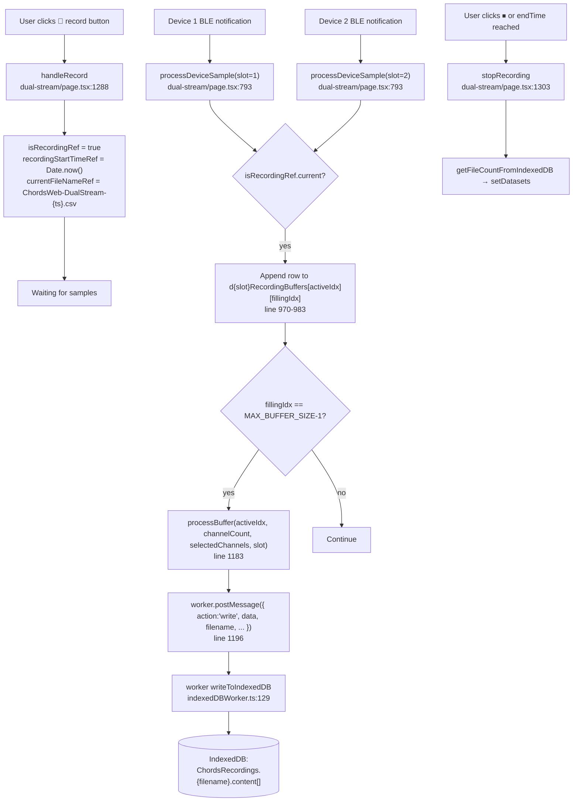
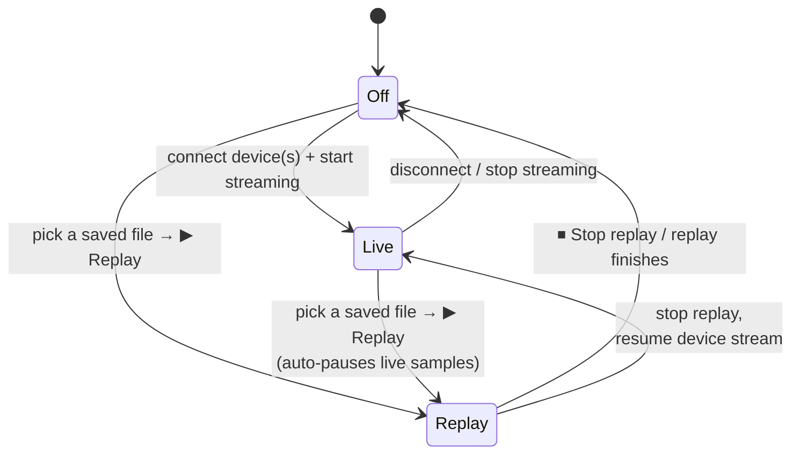
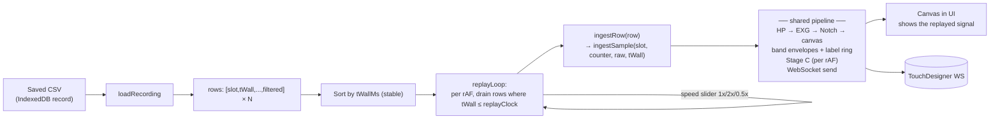

# Dual-Stream Recording & Replay

How recording works today, what it doesn't capture for proper dual-stream replay, and the concrete steps to record both devices and replay the result into TouchDesigner via the existing WebSocket streamer.

---

## 1. How recording works today

Recording lives in three places:

- `src/app/dual-stream/page.tsx` — UI controls, per-device ring buffers, hook into the sample loop.
- `workers/indexedDBWorker.ts` — a `Worker` that owns IndexedDB I/O and CSV/ZIP generation.
- The browser's IndexedDB store `"ChordsRecordings"` (object store of the same name, keyed by `filename`).

### 1.1 State

| Ref | Where | What |
|---|---|---|
| `isRecordingRef` | `dual-stream/page.tsx:56` | Boolean flag read in `processDeviceSample`. |
| `recordingStartTimeRef` | `dual-stream/page.tsx:65` | `Date.now()` snapshot at record start. Used for elapsed-time UI. |
| `endTimeRef` | `dual-stream/page.tsx:66` | Optional auto-stop time (ms). |
| `currentFileNameRef` | `dual-stream/page.tsx:1166` | One filename per recording session; both devices write here. |
| `d1RecordingBuffers`, `d2RecordingBuffers` | `dual-stream/page.tsx:139, 166` | Per-device ring of `NUM_BUFFERS=4` write buffers, each `MAX_BUFFER_SIZE=500` rows long. |
| `d{1,2}ActiveBufferIndex`, `d{1,2}FillingIndex` | `dual-stream/page.tsx:137-138, 164-165` | Per-device rotation/fill cursors. |
| `workerRef` | `dual-stream/page.tsx:1165` | The IndexedDB worker. |

### 1.2 The flow



Each row written to a buffer looks like:

```ts
[ sampleCounter, filteredCh1, filteredCh2, filteredCh3 ]
//   uint8 wraps     post-Notch    post-Notch    post-Notch
```

(`processDeviceSample` line 971-974 slices `channelDataRef.current` to `canvasElementCountRef.current + 1` elements — the counter plus one float per *selected* channel.)

### 1.3 CSV format

When the user clicks Save on a row in the saved-files dropdown, `saveDataByFilename` → worker → `convertToCSV` (`indexedDBWorker.ts:188-228`) emits:

```
Counter,Channel1,Channel2,Channel3
42,0.123,0.087,-0.032
43,0.119,0.091,-0.034
44,0.115,0.094,-0.028
...
```

That's it. No timestamp, no device tag, no raw values, no metadata.

---

## 2. Why this format breaks for dual-stream replay

Five separate problems, in order from "obviously broken" to "subtle":

### 2.1 Device 1 and Device 2 rows are interleaved into one file with no tag

`handleRecord` generates **one** filename. Both `processDeviceSample(1, …)` and `processDeviceSample(2, …)` push to `d1RecordingBuffers` / `d2RecordingBuffers` respectively, then each batch is `processBuffer(..., slot)` → `writeToIndexedDB` with the same `currentFileNameRef.current` (`page.tsx:1188`). The worker appends with no slot column:

```ts
// indexedDBWorker.ts:143-151
if (existingRecord) {
  existingRecord.content.push(...data);   // ← interleaves d1 + d2 batches by arrival order
  ...
}
```

Result: the CSV is `[d1 batch][d2 batch][d2 batch][d1 batch]…` in whatever order the buffers happened to fill. **You cannot tell which device a row came from.**

### 2.2 No timestamp, only an 8-bit packet counter

`sampleCounter = dataView.getUint8(0)` (`page.tsx:811`) wraps every 256 samples (~0.5 s at 500 Hz). It's useful for detecting dropped packets in-flight (line 815-820) but useless for replay timing:
- Both devices' counters are independent — d1's `#42` has no temporal relationship to d2's `#42`.
- The counter wraps too often to reconstruct elapsed time.

There is no `Date.now()` or `performance.now()` per row.

### 2.3 Filters are baked in — no raw signal recorded

The row stores the **post-Notch / post-EXG-LP** filtered value (`channelDataRef.current.push(filteredValue)` at `page.tsx:839`, then that's what gets written at line 971). On replay:
- You can't change the EXG filter mode (EEG/EOG/ECG/EMG) — it's already applied.
- You can't change the notch frequency — it's already applied.
- You can't run band overlays or predominance detection on the replay — those want the HP-filtered signal *before* EXG (`hpOutput`, `page.tsx:831`), which was never saved.

### 2.4 Sampling rate and channel config aren't saved with the file

The CSV header lists `Channel1, Channel2, Channel3`, but doesn't say whether sampling was 250 Hz or 500 Hz, or which physical channel each column corresponded to. Both pieces of metadata exist at runtime (`samplingrateref.current`, `selectedChannels`) but aren't persisted.

### 2.5 No band data or detection booleans

The new predominance detection from `BAND_PREDOMINANCE_DETECTION.md` produces `d{1,2}_ch{N}_is_{alpha,theta,delta}` booleans that TouchDesigner consumes. Recording today captures none of that, so a replay-to-TD has to recompute it from the (currently-not-saved) raw signal.

---

## 3. Goal of the replay feature

> Record a session with both devices connected. Later, load that file and replay it — at the original cadence — through the **same processing pipeline** that live samples flow through. Every effect a sample has while live (canvas draw, filter chain, overlays, detection envelopes/label ring, WebSocket message) must happen identically when the source is a file row instead of a BLE notification.

That means the replayed wire format must match the live wire format (see `WebSocketStreamer.ts:87-130` and the additive band keys we just added), AND the replayed canvas must look the same. Anything TD or the operator reads while live must be reproducible from the file.

### 3.1 Streaming mode is a mutex

The UI has a single "source" that drives the canvas + the WebSocket. At any moment it's in exactly one of three states:

| Mode | Canvas shows | WebSocket sends | BLE notifications |
|---|---|---|---|
| **Off** | nothing / last frame | nothing | accepted but discarded if not connected |
| **Live** | live device samples | live samples | feed `processDeviceSample` |
| **Replay** | rows from the chosen file | rows from the chosen file | **ignored** — replay owns the pipeline |

Live and Replay are **mutually exclusive**. You cannot have both feeding the streamer at once — TD would see interleaved garbage, and the canvas would flicker between two sources. The UI enforces this:

- Entering Replay stops the live stream (or marks the device-sample handler as a no-op).
- Entering Live stops any active replay.
- The mode is a single piece of state, not a pair of toggles that can both be on.



This collapses to one `streamMode: 'off' | 'live' | 'replay'` state variable, plus `currentReplayFilename` when mode is `'replay'`.

---

## 4. Plan

Phased so each step is testable on its own.

### Phase A — Capture enough to replay

Change the recording row from `[counter, ch1, ch2, ch3]` to a richer schema. Two columns matter most: **device slot** and **timestamp**. Everything else is "nice but optional for v1".

**New row shape (per device, per sample):**

```
[ slot, tWallMs, tStreamMs, counter,
  rawCh1, rawCh2, rawCh3,
  filteredCh1, filteredCh2, filteredCh3 ]
```

| Column | Why |
|---|---|
| `slot` | 1 or 2. The fix for §2.1. |
| `tWallMs` | `Date.now() - recordingStartTimeRef.current`. Lets the replay align d1 and d2 on a single timeline and pace samples. |
| `tStreamMs` | `performance.now()` at sample time, optional. Monotonic clock useful if `Date.now()` jumps. |
| `counter` | Keep the 8-bit counter for dropped-packet detection on replay. |
| `rawCh{1,2,3}` | The `int16` from the BLE packet (`dataView.getInt16` at `page.tsx:829`). Saving raw lets users re-run any filter chain on replay. |
| `filteredCh{1,2,3}` | The post-Notch value. Saving filtered lets you replay-without-rerunning-filters for a faithful re-play of what TD originally saw. |

**Where to make the change:**

In `processDeviceSample` at `page.tsx:970-983`, the recorded row is built from `channelDataRef.current` (which is `[counter, filtered1, filtered2, filtered3]`). Replace with an explicit assembly:

```ts
if (isRecordingRef.current) {
    const now = Date.now() - recordingStartTimeRef.current;
    const tStream = performance.now();
    const row = [
        slot,
        now,
        tStream,
        sampleCounter,
        rawChannels[0] ?? 0, rawChannels[1] ?? 0, rawChannels[2] ?? 0,
        ...channelDataRef.current.slice(1, canvasElementCountRef.current + 1),
    ];
    recBuffers.current[activeBufferIdx.current][fillingIdx.current] = row;
    ...
}
```

`rawChannels` is already built at `page.tsx:824, 830`. No new computation, just include it in the row.

**CSV header update** (`indexedDBWorker.ts:192`):

```ts
const header = [
    "Slot", "tWallMs", "tStreamMs", "Counter",
    ...selectedChannels.map(c => `RawCh${c}`),
    ...selectedChannels.map(c => `Ch${c}`)
];
```

**Per-recording metadata sidecar:** add one more record to IndexedDB or one extra row at the top — sampling rate, EXG mode per channel, notch per channel, recording start wall-clock. Two options:

1. **Header rows** — first row of CSV is a comment line `# samplingRate=500, exg={1:3,2:3,3:3}, notch={1:1,2:0,3:0}, startedAt=2026-05-14T...`. Replay parses that line.
2. **Separate IndexedDB record** — `{filename}.meta` keyed alongside the data. Cleaner but more code.

Option 1 is simpler for v1. Both the replay loader and human readers handle it without a schema change.

### Phase B — Load a recording back from IndexedDB

`getFileCountFromIndexedDB` (`page.tsx:1320`, worker side at `indexedDBWorker.ts:311`) already returns the list of filenames. Need a sister method that returns the full content (rows + meta), not just the name.

Add to the worker:

```ts
case 'loadByFilename':
    const record = await performIndexDBTransaction(db, "ChordsRecordings", "readonly", (store) => {
        return new Promise((resolve) => {
            const req = store.index("filename").get(filename);
            req.onsuccess = () => resolve(req.result);
        });
    });
    self.postMessage({ rows: record.content, action: 'loadByFilename' });
    break;
```

In `page.tsx`, a `loadRecording(filename)` that postMessages and returns a `Promise<{ meta, rows }>`.

### Phase C — Refactor: extract a source-agnostic sample handler

Today, BLE input and sample processing are entangled in `processDeviceSample(slot, dataView)` (`page.tsx:793`). The function does two jobs:

1. **Parse**: pull `sampleCounter` + three `int16` channels out of a BLE `DataView`.
2. **Process**: HP → EXG → Notch → push to canvas → run band overlays → run detection envelopes/classify/label-ring → push to recording buffer → send to WebSocket.

Job 2 is shared between live and replay. Extract it:

```ts
// New, source-agnostic. Takes raw int16s + counter + the wall-clock-ish timestamp
// (used only for recording; for live, this is `Date.now() - recordingStart`).
const ingestSample = (slot: 1|2, sampleCounter: number, rawChannels: number[], tWallMs: number) => {
    // … everything from page.tsx:823-967 except the BLE-parse + the recording-buffer write
};

// Live entry: BLE notification handler unchanged structurally.
const processDeviceSample = (slot: 1|2, dataView: DataView): void => {
    if (streamModeRef.current === 'replay') return;          // <— mutex
    const sampleCounter = dataView.getUint8(0);
    const rawChannels = [
        dataView.getInt16(1, false),
        dataView.getInt16(3, false),
        dataView.getInt16(5, false),
    ];
    ingestSample(slot, sampleCounter, rawChannels, Date.now() - recordingStartTimeRef.current);
};

// Replay entry: one row → ingestSample. Same downstream code path.
const ingestRow = (row: number[]) => {
    const [slot, tWallMs, _tStreamMs, counter, r0, r1, r2] = row;
    ingestSample(slot as 1|2, counter, [r0, r1, r2], tWallMs);
};
```

After this refactor, the canvas draws, the band envelopes update, Stage C runs, and the WebSocket sends fire from **one code path** regardless of source. That's what guarantees "the canvas shows what's being streamed to TD" — they're the same thing, just driven from a different `ingestSample` caller.

### Phase D — Replay loop

A scheduler that walks rows in order and feeds them to `ingestSample` via `ingestRow` at the recorded cadence.



**Pacing strategy.** Two approaches:

1. **Wall-clock pacing.** Maintain `replayStartedAt = performance.now()`; for each row, sleep until `performance.now() - replayStartedAt >= row.tWallMs / speed`. Easy, accurate, but each row is one `setTimeout` — overhead for 500 Hz × duration_seconds samples.

2. **Batch-by-frame.** Once per `requestAnimationFrame` (~60 Hz, ~16 ms), drain all rows whose `tWallMs` is `≤ currentReplayTime`. Lower overhead, matches the live render cadence, samples are emitted in tight bursts. TD doesn't care about jitter within a frame.

Recommendation: **(2)**. Matches the existing animation-loop pattern at `page.tsx:1379`.

```ts
const replayTickRef = useRef<number>(0);
const replayStartedRef = useRef<number>(0);
const replayRowsRef = useRef<number[][]>([]);
const replaySpeedRef = useRef<number>(1);

const replayLoop = () => {
    if (streamModeRef.current !== 'replay') return;
    const replayMs = (performance.now() - replayStartedRef.current) * replaySpeedRef.current;
    while (replayTickRef.current < replayRowsRef.current.length) {
        const row = replayRowsRef.current[replayTickRef.current];
        if (row[1] /* tWallMs */ > replayMs) break;
        ingestRow(row);
        replayTickRef.current++;
    }
    if (replayTickRef.current >= replayRowsRef.current.length) {
        stopReplay();
        return;
    }
    requestAnimationFrame(replayLoop);
};
```

**Recompute vs. faithful.** Now that replay routes rows through the same `ingestSample`, the filter chain re-runs from raw on every replayed row by default. That means:
- Overlays the user has enabled at replay time apply to the replayed signal.
- Detection envelopes warm up and Stage C runs against the replayed samples.
- The user can re-tune detection params against a file post-hoc.

This is the "recompute" model. To support "faithful" (TD sees exactly what it saw live), `ingestSample` would need an optional path that skips the filter chain and pushes the recorded filtered values directly to the streamer — out of scope for v1.

### Phase E — UI with mode mutex

The streaming-source button(s) live near the existing TouchDesigner connection toggle. They reflect the `streamMode` state machine from §3.1:

```
┌─ Stream source ────────────────────────────────────────────┐
│                                                             │
│  TouchDesigner: [● Connected — ws://localhost:9980]         │
│                                                             │
│  ◉ Live (devices)                                           │
│      Device 1: ● Connected     Device 2: ● Connected        │
│                                                             │
│  ○ Replay from file                                         │
│      File: [▼ ChordsWeb-DualStream-20260514-101522.csv]     │
│      [▶ Start replay]  [⏸ Pause]  [⏹ Stop]                  │
│      Progress: 23.4 / 60.0 s    Speed: [──●──] 1.0×         │
│                                                             │
└─────────────────────────────────────────────────────────────┘
```

State:

```ts
type StreamMode = 'off' | 'live' | 'replay';
const [streamMode, setStreamMode] = useState<StreamMode>('off');
const streamModeRef = useRef<StreamMode>('off');
useEffect(() => { streamModeRef.current = streamMode; }, [streamMode]);

const [replayFilename, setReplayFilename] = useState<string | null>(null);
```

Transitions:

```ts
const startLive = () => {
    if (streamMode === 'replay') stopReplay();    // mutex
    setStreamMode('live');
    // existing connectDevice(1) / connectDevice(2) flows unchanged
};

const startReplay = async (filename: string) => {
    if (streamMode === 'live') {                  // mutex
        // optional: prompt the user "this will pause live samples"
        // BLE stays connected; processDeviceSample bails on `streamMode === 'replay'`
    }
    const { meta, rows } = await loadRecording(filename);
    applyMeta(meta);                              // restore samplingRate, EXG modes, notch
    replayRowsRef.current = rows;
    replayTickRef.current = 0;
    replayStartedRef.current = performance.now();
    setReplayFilename(filename);
    setStreamMode('replay');
    requestAnimationFrame(replayLoop);
};

const stopReplay = () => {
    if (streamMode !== 'replay') return;
    setStreamMode('off');                         // or 'live' if devices are still connected
    setReplayFilename(null);
    replayRowsRef.current = [];
};
```

The mutex is enforced in three places:

1. **`processDeviceSample`** (`page.tsx:793`) — early-returns when `streamModeRef.current === 'replay'`. BLE notifications keep arriving (we don't disconnect the device) but they go nowhere. The user can flip back to Live without re-pairing.
2. **`replayLoop`** — early-returns when `streamModeRef.current !== 'replay'`. If the user clicks Live mid-replay, the in-flight rAF tick exits cleanly.
3. **The UI radio buttons** — disable the "Start replay" button when `streamMode === 'live'` (or wrap it in a confirm), and disable the device connect buttons when `streamMode === 'replay'`.

### What the canvas shows in each mode

Because both live and replay funnel through `ingestSample`, the canvas always renders whatever source is currently driving the pipeline:

- **Live:** device samples → filter chain → canvas. The user sees real-time EEG. No file is being read.
- **Replay:** file rows → filter chain → canvas. The user sees the recording's waveform sweeping the canvas at 1× (or speed-adjusted) cadence, with overlays and the predominance highlight reflecting the file's content. **The live device's input is not on the canvas — it isn't being processed.**

This is automatic: the canvas is just `wglp.update()` running on the rAF loop, drawing whatever `WebglLine.setY` calls happened since the last frame. The `ingestSample` caller decides which.

---

## 5. End-to-end recipe

The minimum sequence for a user to record dual-stream → replay → TouchDesigner:

1. **Connect both devices** (Device 1 + Device 2 in `dual-stream/page.tsx`). `streamMode` enters `'live'`.
2. **Connect TouchDesigner** WebSocket on `ws://localhost:9980` (or whatever URL — see `WebSocketStreamer.connect`). Independent of `streamMode`; just a sink.
3. **Enable EEG mode + any overlays / detection** you want active during the session. Recording captures raw + filtered regardless of overlay/detection state, so these only affect what's shown locally during the record.
4. **Click the red 🔴 record button** (`page.tsx:1746`). The recorder generates a single filename like `ChordsWeb-DualStream-20260514-101522.csv` and starts appending d1+d2 rows to IndexedDB, each tagged with its slot and a wall-clock offset (Phase A).
5. **Run the session.** Both devices' samples flow through `ingestSample` → canvas + WebSocket → TD, while the same samples are appended to the recording buffer. Recording is in addition to, not instead of, live streaming.
6. **Click ⏹ stop record.** The session ends, the file appears in the saved-files dropdown. `streamMode` is still `'live'` — the devices keep streaming.
7. **Later: switch to Replay mode.** In the Stream Source panel, select **Replay from file**, pick the recording, click **▶ Start replay**. This sets `streamMode = 'replay'`, which:
   - Causes `processDeviceSample` to early-return on every BLE notification — device samples are no longer fed to the canvas or the WebSocket.
   - Starts `replayLoop`, which drains rows from the file at the recorded cadence and calls `ingestSample` for each.
8. **The UI canvas now shows the recorded signal** sweeping as if it were live, with overlays and predominance highlights computed against the replayed data. Below the canvas, the live readout (`d1Live` / `d2Live`) reflects the replay too.
9. **TouchDesigner sees an indistinguishable message stream** — same keys, same cadence, same `d{1,2}_ch{N}_is_alpha` booleans (recomputed from the replayed raw signal). No code in TD changes.
10. Use the speed slider to scrub through faster than real time, **⏸ Pause** to inspect specific moments, or **⏹ Stop** to drop back to `'live'` (or `'off'` if the devices were disconnected).

---

## 6. Risks & open questions

1. **File size.** A 10-minute dual-stream session at 500 Hz × 2 devices × (3 raw + 3 filtered) = ~3.6 M floats. CSV: ~50 MB. ZIP: ~10 MB. Tolerable but not free. If files get larger, consider switching the worker from CSV to a binary format (Float32Array → base64 / blob) on disk — replay parses way faster too.
2. **Clock drift between devices.** Both d1 and d2 deliver samples on their own clocks. We're using *our* wall clock at sample-arrival time as the timestamp, which absorbs network/BLE jitter but loses sub-millisecond accuracy. For sync/desync analysis at the ~10 Hz alpha band this is fine; for tighter timing analysis it isn't.
3. **Selected-channel mismatch on replay.** The recording stored only the channels the user had selected. If on replay the user has a different `selectedChannels` set, do we ignore the UI and use what's in the file, or map by physical channel number? Recommendation: replay overrides `selectedChannels` from the file's metadata header.
4. **Resetting filter / envelope state on mode transitions.** Switching `streamMode: 'live' → 'replay'` (or vice-versa) without clearing the HP/EXG/Notch biquad state and the `BandPowerEnvelope` EMA values will inject a transient — the filters carry state from the previous source's last few seconds into the first samples of the new source. Cleanest fix: in the `setStreamMode` transition, call `setSamplingRate(samplingrateref.current)` on every filter and envelope (their `setSamplingRate` already zeroes internal state when the rate matches; we can add an explicit `reset()` to make this intent clear).
5. **Mutex enforcement in three places, not one.** `streamModeRef` is checked in `processDeviceSample`, `replayLoop`, and the UI button-disable logic. If any of these forgets to check it, the mutex breaks. Worth adding a small helper `assertMode(expected)` and one integration test that flips modes rapidly.
6. **Stage C state at the start of a replay.** Detection envelopes start cold and need ~500 ms to settle, plus a `minRunFrac` window before they can fire. That means the first ~1-2 seconds of a replay will have all booleans false even if the recording started mid-alpha-burst. Document this; or pre-warm the envelopes by feeding them the first N rows synchronously before starting the rAF-paced loop.
7. **TouchDesigner reconnection between live and replay.** Are users likely to disconnect TD between sessions? If yes, the Stream Source panel needs to show TD connection status independently of mode. If no, we can leave the existing TD-connect UI alone.
8. **What about recording while replaying?** Probably out of scope — would let users "edit" a recording by replaying an old one and capturing a new one with different filters. Cute but adds complexity. Default for v1: record is only available in `'live'` mode (button disabled in `'replay'`).
